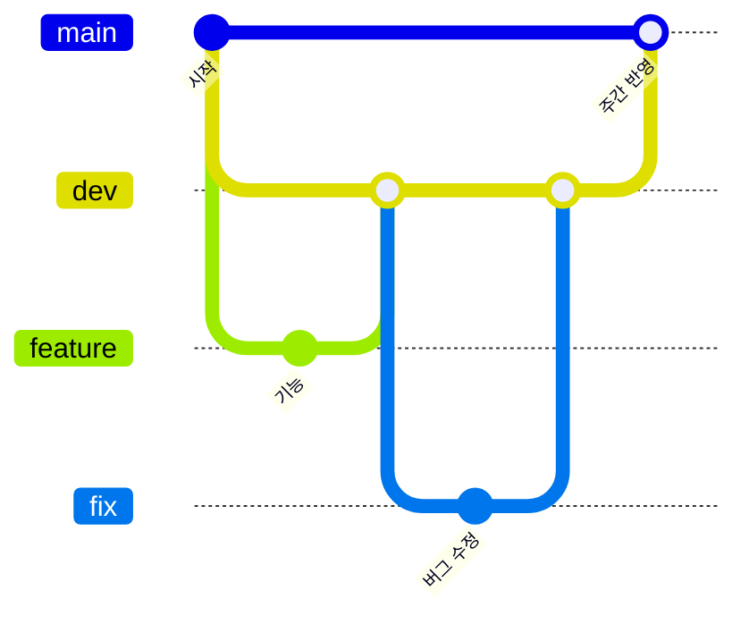

# 작업 규칙 (클라·서버 공통)

조직 `.github` 레포에 있어 모든 레포에 기본으로 적용된다. Pre-commit 관련 내용은 노션의 Pre-commit 페이지를 참고한다. 레포별 규칙은 각 레포의 `docs/conventions.md`를 본다.

## 1. 브랜치

`main`, `dev`, 작업 브랜치로 운영한다. 기능은 `dev`에서 합쳐 확인하고, 완성된 것만 `main`으로 올린다.



| 브랜치 | 용도 |
| --- | --- |
| `main` | 항상 실행 가능한 최종 코드 |
| `dev` | 작업 브랜치가 합쳐지는 통합 브랜치 (GitHub 기본 브랜치) |
| `feature/<이슈번호>-<설명>` | 신규 기능 |
| `fix/<이슈번호>-<설명>` | 버그 수정 |

예) `feature/1-user-signup`, `fix/4-login-error`

- 영어 소문자와 하이픈(-)만 쓴다
- 한 브랜치에서는 하나의 기능만 작업한다
- 모든 작업은 이슈부터 만들고, 이슈 번호로 `dev`에서 브랜치를 딴다
- `main`, `dev`에는 직접 push하지 않고 항상 PR로 반영한다

## 2. 커밋

[Conventional Commits](https://www.conventionalcommits.org/ko/v1.0.0/)를 따른다.

```
<타입>[적용 범위(선택)]: <설명>

[본문(선택)]

[꼬리말(선택)]
```

- `feat`: 새 기능, `fix`: 버그 수정
- `docs`, `style`, `refactor`, `test`, `chore` 등은 필요하면 사용
- 하위 호환이 깨지면 타입 뒤에 `!` 또는 `BREAKING CHANGE:` 꼬리말

예) `feat(parser): add ability to parse arrays`

## 3. PR과 머지

### PR 제목

`[타입] 작업 내용` — 예) `[feat] 회원가입 API 구현`, `[fix] 게임 결과 저장 오류 수정`

본문은 각 레포의 PR 템플릿을 따른다.

### 리뷰

- 기본 리뷰어 1명, 보조 리뷰어 1명을 지정한다
- 작성자는 본인 PR을 승인할 수 없다
- 작은 단위로 PR을 만든다
- 새 기능에는 테스트 코드를 함께 넣는다

### 머지

| PR | 머지 방식 | 언제 |
| --- | --- | --- |
| 작업 브랜치 → `dev` | Rebase (불가피할 때만 다른 방식) | 승인 + 테스트 통과 시 |
| `dev` → `main` | **Merge commit만** | 매주 금요일, 또는 시연·빌드를 뽑을 때 |

- 리뷰어 1명 이상 승인 + 테스트(CI) 통과 시 머지한다
- 머지 전 최신 `dev`를 반영하고, 충돌은 작성자가 해결한다
- 머지 후 작업 브랜치는 삭제한다
- `dev` → `main`을 Rebase나 Squash로 머지하지 않는다. 커밋 ID가 달라져 다음 반영 때 중복 커밋과 충돌이 생긴다
- `dev` → `main` PR은 전체 플레이(클라)와 전체 테스트(서버)를 확인한 뒤 머지한다
- 긴급 수정도 따로 브랜치를 두지 않고 `dev`에서 고친 뒤 바로 `main`으로 올린다

### 순서

이슈 생성 → `dev`에서 브랜치 생성 → 커밋 → push → `dev`로 PR 생성 → 리뷰어 지정 → 리뷰 반영 → 승인 → 머지

## 4. 스텁 PR

다른 시스템이 쓸 인터페이스를 새로 만들면, 구현보다 스텁 PR을 먼저 올린다.

1. 인터페이스 + 빈 구현 + DI 등록만 커밋 (클라: 인스톨러, 서버: 빈 등록)
2. 당일 머지
3. 최신 `dev`에서 구현 브랜치를 새로 딴다

## 5. 문서

코드와 문서가 어긋나면 코드가 맞다. 규칙, 구조, API 계약이 바뀌는 PR은 같은 PR에서 `docs/`를 고친다. 결정과 이유는 노션 회의록에 남긴다.

## 6. 리뷰 체크리스트

**기능/로직** — 요구사항대로 동작하는가, 예외와 엣지 케이스를 처리했는가

**코드 품질** — 네이밍이 명확한가, 중복이나 불필요한 복잡함은 없는가, 기존 구조·컨벤션과 맞는가

**테스트** — 새 기능의 테스트가 있는가, 실패 케이스도 검증하는가

**PR 설명** — 작업 내용과 확인 방법이 명확한가, 리뷰어 요청 사항을 확인했는가

**보안** — API 키, 토큰, 비밀번호가 하드코딩되지 않았는가 (gitleaks가 1차로 걸러주지만 한 번 더 확인)
